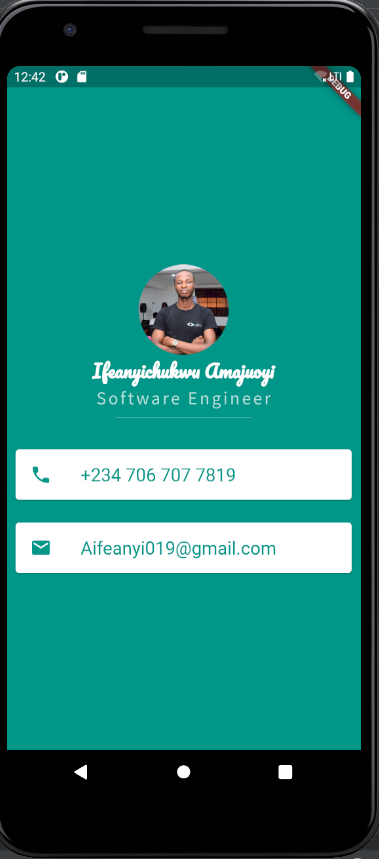

# Mi Card

## The Goal

The goal of this project is to learn more about how to design user interfaces for Flutter apps.

## What you will create

Mi Card is a personal business card. Imagine every time you wanted to give someone your contact details or your business card but you didn't have it on you. Well, now you can get them to download your business card as an app.

## Flutter concepts learnt

* How to create Stateless Widgets
* What is the difference between hot reload and hot refresh and running an app from cold
* How to use Containers to lay out your UI
* How to use Columns and Rows to position your UI elements
* How to add custom fonts
* How to add Material icons
* How to style Text widgets
* How to read and use Flutter Documentation

>This is a companion project to The App Brewery's Complete Flutter Development Bootcamp, check out the full course at [www.appbrewery.co](https://www.appbrewery.co/)

